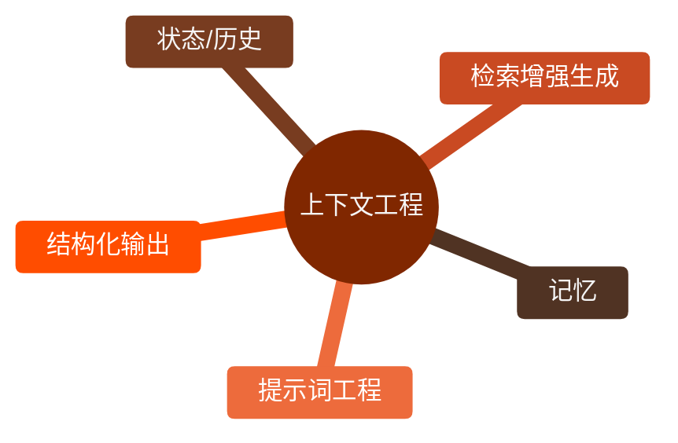
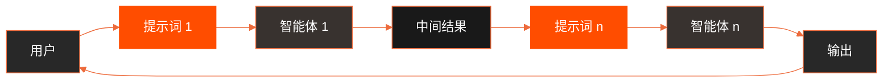

上下文工程（见图 1.1）是一门系统性学科，其目标是在大模型生成内容之前，为模型设计、构建并提供一个完整的信息环境。该方法认为，模型的输出质量更多取决于模型上下文的丰富程度，而不是模型架构本身。

*图 1.1 上下文工程是为 AI 构建丰富、全面的信息环境的学科，因为上下文的质量是实现高级智能体能力的主要因素。*

上下文工程是传统提示词工程的重大演进。传统提示词工程主要侧重于优化用户即时查询的措辞，而上下文工程则将范围扩展至包含多个层次的信息，例如系统提示词，即定义 AI 操作的基础指令参数，如“你是一名技术撰稿人，你的语气必须正式且精确”。上下文信息可通过外部数据进一步丰富。这主要包括两类：一是检索到的文档，即 AI 主动从知识库中获取的辅助信息，如某个项目的技术规格；二是工具输出，即 AI 通过外部 API 获得的实时数据，如查询日历得到的用户时间可用性。这些显式数据还与用户身份、交互历史和环境状态等关键的隐式数据相结合。其核心原则在于，即便是先进模型，若其操作环境的视图受限或构建不当，效果也会大打折扣。

因此，上下文工程将 AI 的任务从单纯回答问题重新定义如下：为智能体构建全面的操作图景。例如，一个经过良好设计的智能体在回复查询时，会主动整合用户的日历可用性（工具输出）、与邮件收件人的专业关系（隐式数据），以及过往会议记录（检索到的文档）。这使得模型能够生成高度相关、个性化且切实有用的输出。“工程”这一要素具体体现在创建强大的数据管道，以便在运行时自动获取和转换这些数据，并建立反馈循环以持续提升上下文质量。

为实现这一目标，可使用专门的调优系统来大规模自动化改进过程。例如，Google 的 Vertex AI 提示优化器这类工具，能够基于一组示例输入和预定义的评估指标系统地评估回复，从而提高模型性能。此方法在不同模型间调整提示和系统指令时尤为有效，无须大量手动重写。通过向优化器提供示例提示、系统指令和模板，即可通过编程方式优化上下文输入，为实现复杂上下文工程所需的反馈循环提供结构化支持。

这种结构化方法正是基础 AI 工具与更复杂、具备上下文感知能力的 AI 系统之间的关键区别。它将上下文本身视为核心组件，高度关注智能体“知道什么”“何时知道”以及“如何使用”。这一实践确保了模型能全面理解用户的意图、历史交互与当前环境。最终，上下文工程成为将无状态聊天机器人演进为功能强大、具备深度情境感知能力系统的关键方法。

## 概览

**问题所在**：当在单个提示词中处理复杂任务时，大语言模型常常不堪重负，进而引发严重的性能问题。模型的认知负担加重，出现诸如忽视指令、丢失上下文以及生成错误信息等错误的可能性也随之增加。单一的整体性提示词难以有效地应对多个限制条件和连续的推理步骤。由于大语言模型无法全面处理复杂请求的各个方面，最终会导致输出结果不可靠且不准确。

**解决原理**：提示链通过将复杂问题分解为一系列较小的、相互关联的子任务，提供了一种标准化的解决方案。链中的每一步都使用一个有针对性的提示词来执行特定操作，这极大地提高了可靠性和可控性。一个提示词的输出会作为下一个提示词的输入，从而创建一个逐步构建直至得出最终解决方案的逻辑工作流程。这种模块化、分而治之的策略使整个过程更易于管理和调试，并且允许在各步骤之间集成外部工具或结构化数据格式。这种模式是开发复杂多步骤智能体系统的基础，这些系统能够进行规划、推理并执行复杂的工作流程。

**经验法则**：当某个任务对于单个提示词而言过于复杂，涉及多个不同的处理阶段，在步骤之间需要与外部工具进行交互，或者在构建需要进行多步骤推理并维持状态的智能体系统时，可采用这种模式。

视觉摘要：提示链模式如图 1.2 所示。

*图 1.2 提示链模式：智能体从用户那里接收一系列提示词，链中每个智能体的输出都作为下一个智能体的输入。*

## 核心要点

以下是一些核心要点。

- 提示链将复杂任务分解为一系列更小、更具针对性的步骤。这种方式有时也被称为流水线模式。
- 链中的每一步都涉及对大语言模型的调用或处理逻辑，并且将上一步的输出用作输入。
- 这种模式提高了与大语言模型进行复杂交互时的可靠性和可管理性。
- LangChain、LangGraph 以及 Google ADK 等框架提供了强大的工具，用于定义、管理和执行这些多步骤序列。

## 结论

通过将复杂问题解构为一系列更简单、更易于管理的子任务，提示链为大语言模型提供了一个强大的框架。这种“分而治之”的策略通过让模型一次专注于一个特定操作，显著提高了输出的可靠性和可控性。作为一种基础模式，它使开发能够进行多步骤推理、工具集成和状态管理的复杂 AI agent 成为可能。最终，掌握提示链技术对于构建强大的、具备上下文感知能力的系统至关重要，这些系统能够执行远超单个提示词能力范围的复杂工作流程。
